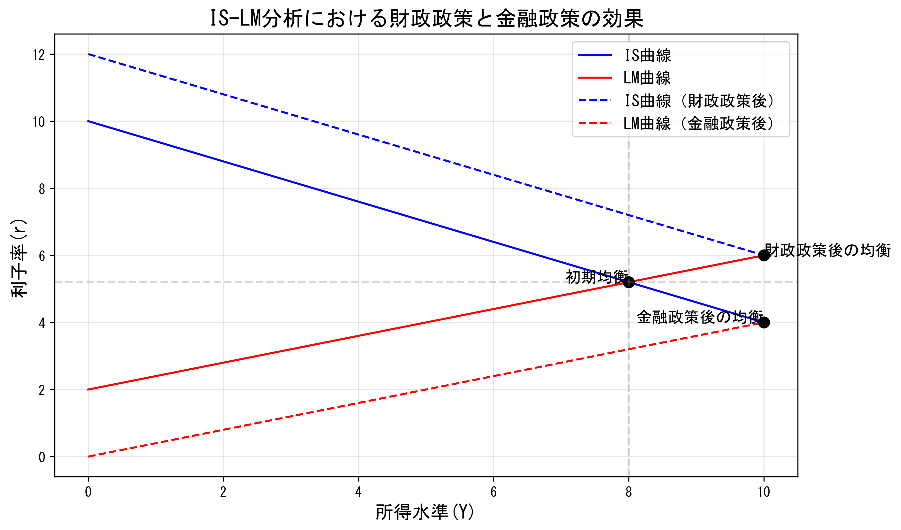
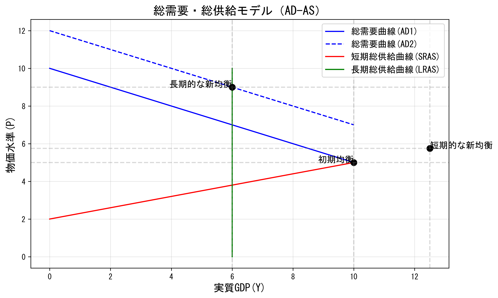
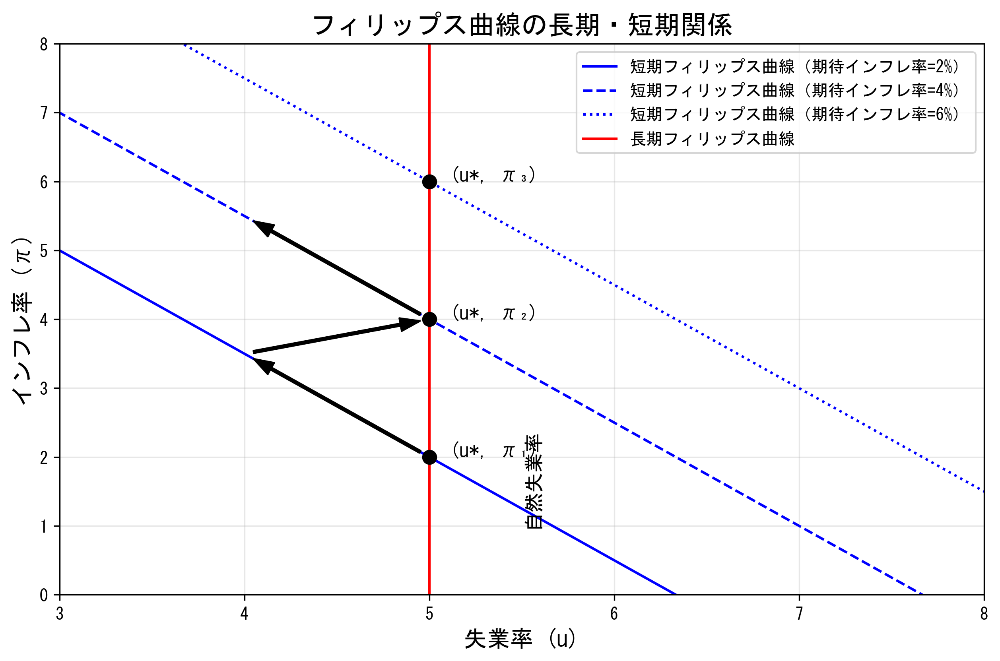
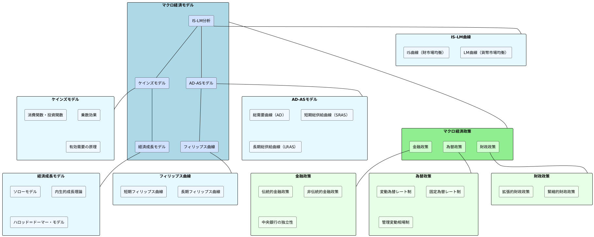

# 第2章：マクロ経済理論と経済政策

## 1. 導入問題（典型問題）

**問題1**: IS-LM分析において、拡張的財政政策がクラウディングアウトを引き起こす理由として最も適切なものはどれか。
1. 政府支出の増加により消費が減少するため
2. 政府支出の増加が利子率を上昇させ、民間投資を減少させるため
3. 政府支出の増加により輸出が減少するため
4. 政府支出の増加により物価水準が上昇するため

**問題2**: 短期的に総需要が増加した場合の影響として正しいものはどれか。
1. 実質GDPのみが増加する
2. 物価水準のみが上昇する
3. 実質GDPと物価水準の両方が増加する
4. 実質GDPが増加し、物価水準は変化しない

## 2. 核心問題（本質理解確認問題）

**問題A**: IS-LM分析における財政政策と金融政策の効果の違いを説明し、どのような経済状況においてそれぞれの政策がより効果的かを論じよ。

**問題B**: フィリップス曲線に関する考え方の変遷を説明し、短期と長期におけるインフレ率と失業率の関係について論じよ。

## 3. 解説と理論展開

### 導入問題の解答

**問題1の解答**: 2. 政府支出の増加が利子率を上昇させ、民間投資を減少させるため

**解説**:
IS-LM分析では、拡張的財政政策（政府支出の増加や減税）によりIS曲線が右にシフトします。これにより、均衡点は右上方向に移動し、所得（Y）の増加と利子率（r）の上昇が生じます。利子率の上昇は民間投資を減少させるため、政府支出の増加による所得の拡大効果が一部相殺されます。この現象をクラウディングアウト（民間投資の締め出し）といいます。

**問題2の解答**: 3. 実質GDPと物価水準の両方が増加する

**解説**:
総需要・総供給モデル（AD-ASモデル）において、短期的な総需要の増加は総需要曲線を右にシフトさせます。短期的には総供給曲線が右上がりであるため、総需要の増加は実質GDPと物価水準の両方を上昇させます。長期的には、価格や賃金の調整により、経済は自然産出量水準に戻り、物価水準のみが上昇することになります。

### 核心問題の解答と理論展開

**問題Aの解答**:

IS-LM分析における財政政策と金融政策の効果の違いは以下の通りです。

**財政政策の効果**:
財政政策（政府支出の増加や減税）はIS曲線をシフトさせることで効果を発揮します。拡張的財政政策はIS曲線を右にシフトさせ、所得（Y）と利子率（r）を上昇させます。しかし、利子率の上昇は民間投資を減少させるため、政策効果が一部相殺されます（クラウディングアウト）。

**金融政策の効果**:
金融政策（マネーサプライの変更）はLM曲線をシフトさせることで効果を発揮します。拡張的金融政策はLM曲線を右にシフトさせ、所得（Y）を増加させ、利子率（r）を低下させます。利子率の低下は民間投資を刺激するため、所得拡大効果がさらに強まります。

**各政策の有効性を左右する要因**:

1. **IS曲線の傾き（投資の利子弾力性）**:
   - 投資が利子率に敏感な場合（IS曲線が平坦）→金融政策が有効
   - 投資が利子率に鈍感な場合（IS曲線が急勾配）→財政政策が有効

2. **LM曲線の傾き（貨幣需要の利子弾力性）**:
   - 貨幣需要が利子率に敏感な場合（LM曲線が平坦）→財政政策が有効
   - 貨幣需要が利子率に鈍感な場合（LM曲線が急勾配）→金融政策が有効

3. **流動性の罠**:
   利子率が極めて低い水準にあり、追加的な貨幣供給が利子率をほとんど低下させない状況では、LM曲線がほぼ水平となり、金融政策の効果は限定的です。この場合、財政政策がより効果的となります。

4. **クラウディングアウト効果の大きさ**:
   開放経済では、資本移動の程度によってクラウディングアウト効果の大きさが変わります。完全資本移動の場合、財政政策の効果は為替レートの変動により相殺される可能性があります。

**問題Bの解答**:

フィリップス曲線に関する考え方は次のように変遷してきました。

**初期のフィリップス曲線(1958年)**: 
イギリスの経済学者A.W.フィリップスが失業率と名目賃金上昇率の間に安定した負の相関関係を発見し、失業率を下げようとすると賃金上昇率（インフレ）が高まるというトレードオフ関係を示しました。

**サミュエルソン・ソロー版(1960年代)**: 
名目賃金上昇率の代わりにインフレ率を用いて、失業率とインフレ率の間のトレードオフ関係を示しました。この関係は政策立案者に「メニュー」を提供すると考えられ、政府は失業率とインフレ率の組み合わせを選択できると解釈されました。

**フリードマン・フェルプスの自然失業率理論(1968年)**: 
長期的には失業率とインフレ率の間にトレードオフは存在せず、失業率は「自然失業率」（後に「インフレ非加速的失業率：NAIRU」と呼ばれる）に収束するという考え方が提唱されました。彼らは、人々がインフレ期待を形成し、それに基づいて行動するため、継続的な拡張政策は一時的に失業率を下げるだけで、長期的にはインフレ率のみを上昇させると主張しました。

**短期と長期のフィリップス曲線**:

**短期フィリップス曲線**: 
短期的には、インフレ期待が一定である限り、失業率とインフレ率の間にトレードオフ関係が存在します。総需要を刺激する政策は一時的に失業率を引き下げますが、インフレ率を上昇させます。

**長期フィリップス曲線**: 
長期的には、人々のインフレ期待が実際のインフレ率に適応するため、フィリップス曲線は自然失業率（u*）において垂直となります。つまり、長期的には失業率とインフレ率の間にトレードオフは存在せず、拡張政策は失業率に持続的な影響を与えることなく、インフレ率のみを上昇させます。

**合理的期待理論とフィリップス曲線**:
1970年代には、ルーカスらによる合理的期待理論が登場し、人々が将来のインフレを正確に予測するならば、短期的なフィリップス曲線のトレードオフも存在しないとする見方も提示されました。この見方によれば、予期された金融政策は実質変数（失業率や実質GDP）に影響を与えず、予期されない政策のみが短期的な効果を持ちます。

**現代のフィリップス曲線理論**:
現代では、ニューケインジアンフィリップス曲線(NKPC)が提唱され、インフレ率は期待インフレ率と実質限界費用（または産出ギャップ）に依存するとされています。また、グローバル化や中央銀行の独立性、インフレターゲティングの採用などにより、フィリップス曲線が平坦化しているという議論もあります。

## 4. 図解とモデル

### IS-LM曲線と財政・金融政策

IS-LM分析は、財市場と貨幣市場の同時均衡を分析するモデルです。IS曲線は財市場の均衡を表し、LM曲線は貨幣市場の均衡を表します。両曲線の交点が経済全体の均衡点となります。

### 総需要・総供給モデル（AD-AS）

AD-ASモデルは、総需要曲線（AD）と総供給曲線（AS）の交点で経済の均衡が決定されることを示します。短期的な総供給曲線（SRAS）は右上がりであり、長期的な総供給曲線（LRAS）は潜在GDP水準で垂直となります。

### フィリップス曲線の長期・短期関係

フィリップス曲線は、インフレ率と失業率の関係を示す曲線です。短期的にはトレードオフ関係が存在しますが、長期的には自然失業率において垂直となります。

### マクロ経済モデルの関連図

上図はマクロ経済モデルと政策の関連を示しています。

## 5. 応用問題

**問題C**: 中央銀行がインフレ目標を2%と設定している経済において、景気後退により失業率が上昇し、インフレ率が1%に低下した場合、どのような金融政策を採るべきか。また、その政策が効果を発揮するためのメカニズムと、有効性を左右する要因について説明せよ。

**解答例**:
インフレ目標2%に対して実際のインフレ率が1%と低く、さらに景気後退で失業率が上昇している状況では、中央銀行は拡張的金融政策（金利引き下げやマネタリーベースの拡大など）を採るべきです。

**拡張的金融政策のメカニズム**:
1. 政策金利の引き下げ→市場金利の低下
2. 金利低下→投資や耐久消費財支出の増加
3. 資産価格上昇→富効果による消費増加
4. 為替レート減価→純輸出の増加
5. 総需要の拡大→景気回復とインフレ率上昇

**有効性を左右する要因**:
1. 流動性の罠：金利がゼロ近傍まで低下すると、通常の金融政策の有効性が低下
2. バランスシート調整：家計や企業が債務削減優先の場合、金利低下の効果が限定的
3. 信用創造機能の低下：銀行のリスク回避志向が強まると、貸出増加につながりにくい
4. 期待形成：インフレ期待が低く固定化すると、実質金利低下効果が限られる

このような状況では、量的・質的金融緩和やフォワードガイダンス（将来の金融政策の方向性を示す）など、非伝統的な金融政策手段も考慮すべきです。深刻な景気後退の場合は、財政政策との政策協調も有効な選択肢となります。

## 6. 要点まとめ

### IS-LM分析
- IS曲線：財市場の均衡を表す（投資=貯蓄）
- LM曲線：貨幣市場の均衡を表す（貨幣需要=貨幣供給）
- 財政政策：IS曲線をシフトさせる
- 金融政策：LM曲線をシフトさせる
- クラウディングアウト：財政拡大による利子率上昇が民間投資を抑制する現象

### 総需要・総供給（AD-AS）モデル
- 総需要曲線（AD）：消費、投資、政府支出、純輸出の合計
- 短期総供給曲線（SRAS）：短期的には右上がり
- 長期総供給曲線（LRAS）：長期的には潜在GDP水準で垂直
- 需要ショック：短期的にはGDPと物価に影響、長期的には物価のみに影響
- 供給ショック：GDPと物価に逆方向の影響（スタグフレーション）

### フィリップス曲線
- 短期フィリップス曲線：インフレ率と失業率の間に負の相関関係
- 長期フィリップス曲線：自然失業率において垂直
- インフレ期待の役割：期待インフレ率の変化により短期フィリップス曲線がシフト
- 自然失業率（NAIRU）：インフレ率を加速させない失業率

### 財政政策
- 拡張的財政政策：政府支出増加、減税
- 緊縮的財政政策：政府支出削減、増税
- 自動安定化装置：景気変動を自動的に緩和する仕組み（累進課税、失業保険等）
- 財政政策の限界：時間ラグ、クラウディングアウト、リカードの等価定理

### 金融政策
- 伝統的金融政策：政策金利操作によるマネーサプライのコントロール
- 非伝統的金融政策：量的緩和、信用緩和、フォワードガイダンス
- 金融政策の波及経路：金利経路、資産価格経路、為替レート経路、期待経路
- 金融政策の限界：流動性の罠、時間ラグ、不確実性

### 生産物市場とGDP
- 国内総生産（GDP）の三面等価：生産・支出・分配
- 国民所得の決定：有効需要が国民所得を決定
- 消費関数：所得に依存する消費支出の関係
- 投資関数：利子率や期待収益率に依存する投資支出の関係
- 政府支出：財政政策の直接的な手段
- 純輸出：為替レートや内外所得水準に依存

### 貨幣市場と利子率
- 貨幣需要関数：取引需要、予備的需要、投機的需要
- 貨幣供給：中央銀行によるコントロール
- 均衡利子率：貨幣需要と貨幣供給が一致する点
- 流動性選好説：利子率は貨幣に対する流動性選好と貨幣量によって決定

### 雇用と物価水準
- オークンの法則：失業率と潜在GDPからの乖離の関係
- 賃金決定メカニズム：労働市場の需給と交渉力
- 物価決定メカニズム：企業のマークアップ価格設定
- コスト・プッシュ・インフレとディマンド・プル・インフレ

### 景気変動と景気循環
- 景気循環の諸段階：後退期、底、回復期、拡張期、ピーク
- 外生的ショック：技術ショック、政策ショック、期待ショック
- 内生的メカニズム：加速度原理、乗数効果、在庫循環
- 長期トレンドと循環変動の分解

## 7. マインドマップ

## 8. 復習クイズ
1. 拡張的財政政策と拡張的金融政策が同時に実施された場合、IS-LM分析において利子率はどのように変化するか？
2. 総供給ショック（例：原油価格の高騰）が生じた場合、AD-ASモデルにおいて実質GDPと物価水準はどのように変化するか？
3. フィリップス曲線が平坦化する要因として考えられるものは何か？
4. 政府支出乗数が大きくなる条件は何か？
5. 中央銀行の独立性が重視される理由は何か？
6. IS曲線の傾きを決定する要因は何か？
7. LM曲線の傾きを決定する要因は何か？
8. なぜ長期的には経済は自然失業率に収束するのか？
9. 財政政策と金融政策の時間ラグの違いは何か？
10. インフレターゲティングの利点と課題は何か？ 